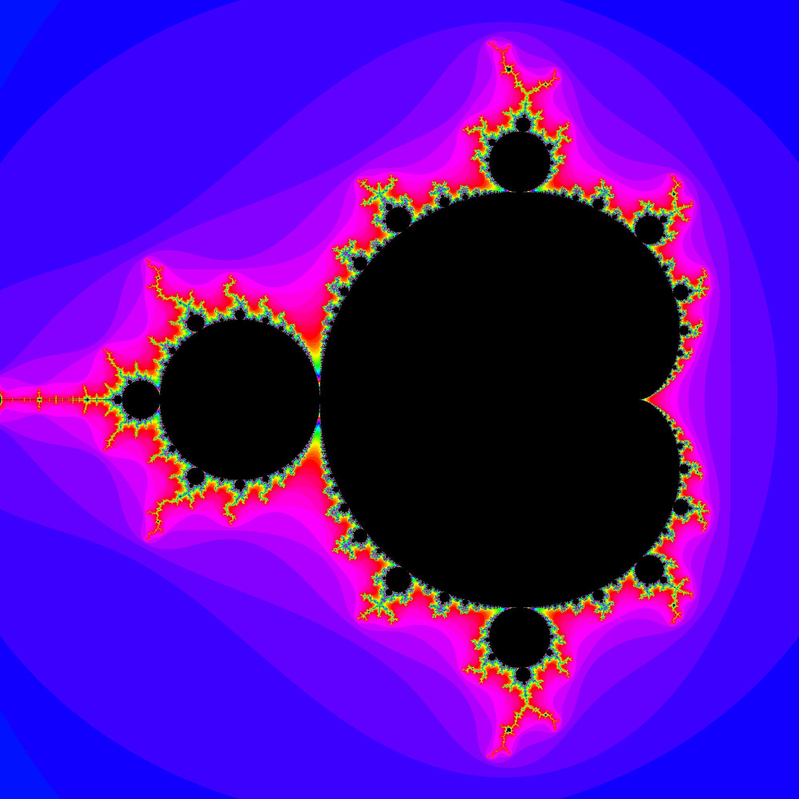

# mandelbrot-set-image-creator

/!\ New web version faster and better at https://briossant.com/Maths/Fractal/Mandelbrot/ /!\

Python programs that creates images of the mandelbrot set :

to start it lunch main.py

 + requirements : 

tkinter and pillow library

 + info :

tested on linux mint cinnamon

size need to separated with an 'x'

color range and zoom can't be = 0

if you choose a big zoom, put a large number to max_iterations

 + example :

