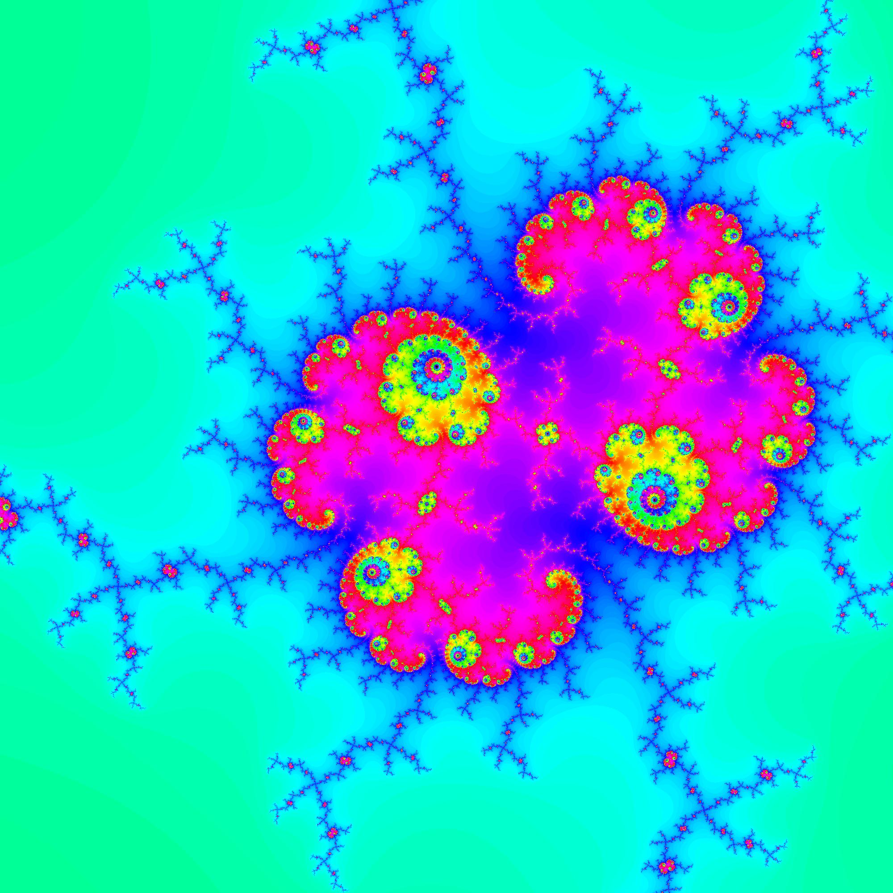

# mandelbrot-set-image-creator
Python program that creates images of the mandelbrot set :

to start it lunch main.py

 + requirements : 

tkinter and pilow library

 + info :

tested on linux mint cinameon

size and other pair of numbers need to seperated with an 'x'

if you choose a small interval, put a large number to max_iterations

 + example :

